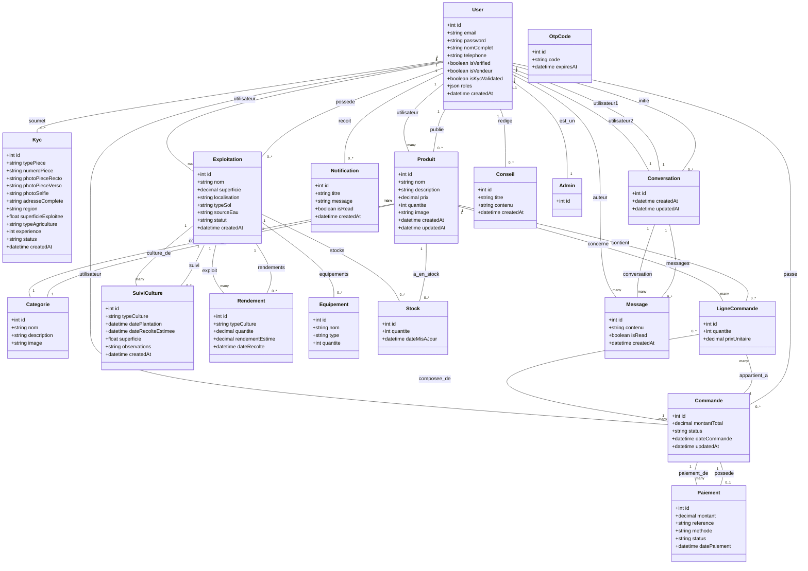

# Diagramme de Classes - KilysAgri

## Légende des Statuts

### Statut KYC
- `en_attente` - En cours de validation
- `valide` - Validated
- `rejete` - Rejected

### Statut Commande
- `en_attente` - En attente de paiement
- `payee` - Payée
- `en_cours` - En cours de traitement
- `livree` - Livrée
- `annulee` - Annulée

### Statut Paiement
- `en_attente` - En attente
- `valide` - Validated
- `echoue` - Failed

## Rôles Utilisateurs

| Rôle | Description |
|-------|-------------|
| VISITEUR | Peut seulement parcourir les produits |
| ACHETEUR | Utilisateur connecté, peut acheter |
| PRODUCTEUR | Acheteur + KYC validé, peut vendre |
| ADMIN | Gestion de la plateforme |
